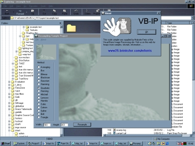



## Professional Resampling in Visual Basic

### Description

There were some missing files in the zip - apologies for that guys... fixed now ;-)

This project and it's associated tutorial show how to do professional resampling on an image in Visual Basic. Some advanced OOP techniques are used to accomplish this and you get a choice of 15 different resampling techniques including box filtering, gauss filter, spline filter ...

This code was converted from an existing C++ implementation I found whilst strolling around the next search engines ;-)

Check out the tute for this project at http://www25.brinkster.com/mferris.

If you like this please don't forget to comment, vote, contact me ...
 
### More Info
 

             |
---                |---
**Submitted On**   |2002-08-29 15:04:58
**By**             |[Meltdown Charlie](https://github.com/Planet-Source-Code/PSCIndex/blob/master/ByAuthor/meltdown-charlie.md)
**Level**          |Advanced
**User Rating**    |4.7 (33 globes from 7 users)
**Compatibility**  |VB 6\.0
**Category**       |[Graphics](https://github.com/Planet-Source-Code/PSCIndex/blob/master/ByCategory/graphics__1-46.md)
**World**          |[Visual Basic](https://github.com/Planet-Source-Code/PSCIndex/blob/master/ByWorld/visual-basic.md)
**Archive File**   |[Profession1309899142002\.zip](https://github.com/Planet-Source-Code/meltdown-charlie-professional-resampling-in-visual-basic__1-38979/archive/master.zip)

